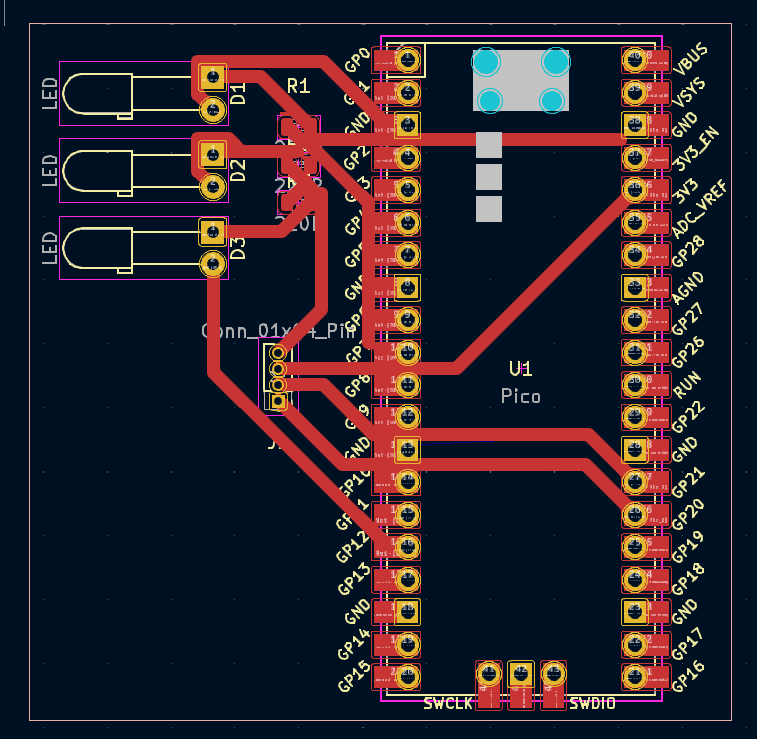
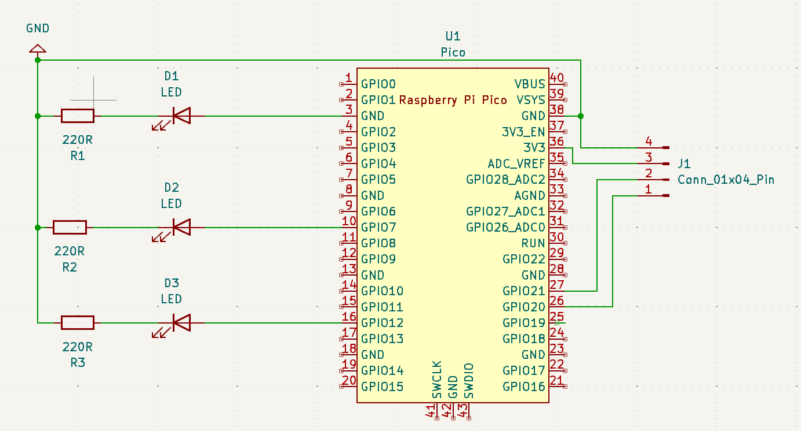
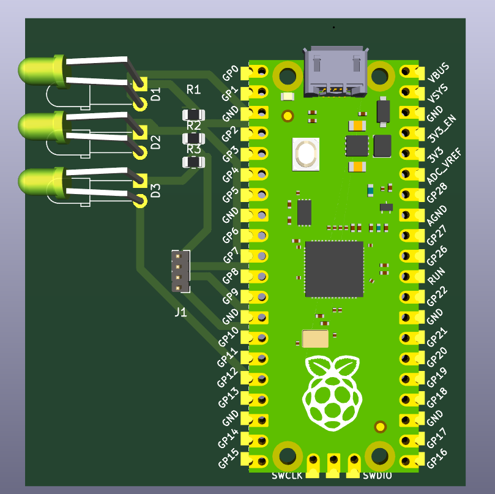

# Placa de circuito impresso com Raspberry Pi Pico

Esta atividade tem por objetivo desenvolver uma placa de circuito impresso capaz de receber um Raspberry Pi Pico W encaixado utilizando um dispositivo conector, além de um hardware para acionar uma interface de potência (relé e transistor), um dispositivo sinalizador (LED ou Buzzer) e um dispositivo de entrada (analógico ou digital). Esta placa deverá ser construída utilizando o software de CAD para placas eletrônicas utilizado no módulo vigente. O software utilizado foi o KiCad.

## Arquivos

Dentro da pasta `projeto` é possível encontrar os arquívos `projeto.kicad_pcb` que se encontra a pcb do projeto, `projeto.kicad_prl`, `projeto.kicad_pro`, `projeto.kicad_sch` do esquema, `~projeto.kicad_pcb.lck`

## PCB

## Schema

## 3D

